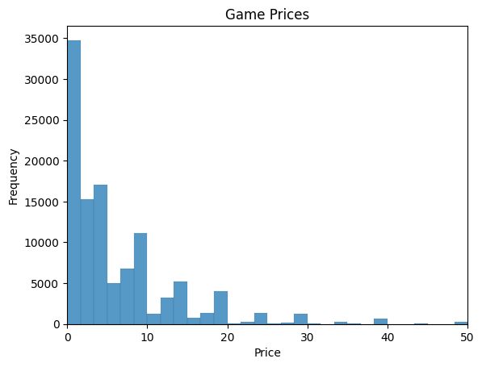
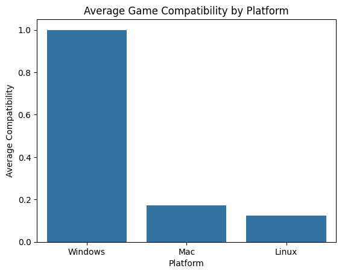
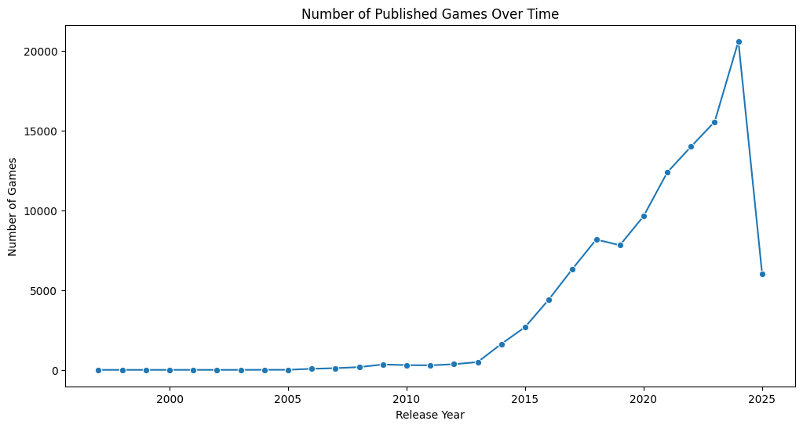

# Steam Games Dataset Analysis
Homework #3: Collaborative Data Wrangling & EDA
DSE 511 – Fall 2025

## Dataset Source and Description
The dataset used in this project is the Steam Games Dataset originally sourced from Kaggle (accessed September 2025). The csv file we used has over 110000 rows.
Here is a link:

https://www.kaggle.com/datasets/fronkongames/steam-games-dataset

It contains information about games published on Steam, including attributes such as:

- Game name
- Price
- Description text (“About the game”)
- Release year
- Device compatibility (Windows, Mac, Linux)

## EDA 

Davis Hunter performed Exploratory Data Analysis (EDA), including price trends, game description word/phrase analysis, platform compatibility, and release year trends.

Here are some results:

The average price of a game on Steam is \$7.06.
The standard deviation of prices is \$12.56.

Since the standard deviation is so large, we infer there are outliers in the data that pull the average price up. When we look at the data we find that 'The Leverage Game' is $1000!

Here is a histogram of game prices:

Most games are below $5.

Only $17.8\%$ of games are compatible with Mac. So if you want to game on steam, you should buy a Windows computer. 

The number of games published on Steam is increasing exponentially. There is a dip in 2025 since the year is not over yet and the data is 5 months out of date.

## Reproducibility Instructions

Use `notebooks/data_cleaning.ipynb` to download and clean the data.
Use `notebooks/eda.ipynb` to perform our exploratory data analysis.

## Merge Conflict Reflection:

Davis - I had a merge conflict within the README. It was changed on github.com and in my IDE. I didn’t to pull before I pushed. To resolve the conflict, I merged the two and deleted the unwanted changes, and then pushed the result.

